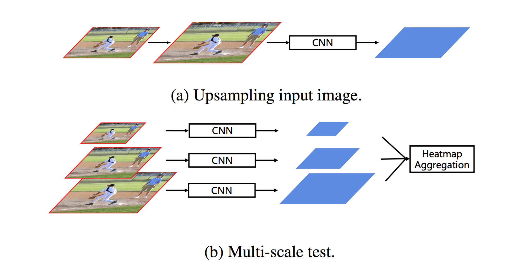

## Bottom-up Higher-Resolution Networks for Multi-Person Pose Estimation

(Paper released on Aug 27, 2019)

### Background and motivation

Typical bottom-up pipeline consists of two main steps: 1) **heatmap prediction**; 2) **keypoint grouping**.

#### Pros and cons of bottom-up pose estimation methods compared to the top-down ones:
- Pros
  - Unlike top-down methods that rely on a separate person detector and need to estimate pose for every person individually, bottom-up methods are more **efficient and suitable for real-time** applications.
  - Because top-down methods consists of several modules such as detection and pose estimation, so they're **not truly end-to-end systems**. In contrast, bottom-up methods could be designed as true end-to-end systems.
- Cons
  - There still exists a large gap between the performances of bottom-up and top-down methods
    - This paper argues that based on the literature [1], person grouping is easier than keypoint detection. **The main problem of bottom-up methods lies in inaccurate heatmap prediction.**
  - Unlike top-down methods can normalize all the persons to approximately the same scale by cropping and resizing the detected person bounding boxes, bottom-up methods are sensitive to the scale variance of persons
    - In most cases, bottom-up methods are **good at localizing keypoints precisely for large persons** while **inaccurate for smaller persons**
    - *The authors hypothesize that the inferior in keypoint prediction for smaller persons is caused by insufficient feature map resolution*
    - Most state-of-the-art performances on various multi-person human pose estimation benchmarks are achieved by top-down methods

Figure 1. Three testing approaches of bottom-up methods.

### Key ideas of this paper (HigherHRNet)
- Bottom-up multiperson human pose estimation and focuses on **better heatmap prediction**
  - An extension of the HRNet framework
- HigherHRNet generates higher-resolution feature maps by **deconvolving the high-resolution feature maps** outputted by
HRNet
  - The higher-resolution feature maps are **spatially more accurate** for small and medium persons
  - Basically the proposed method builds **high-quality multi-level features** and perform **multi-scale pose prediction**
- The extra computation overhead is marginal and negligible compared to the existing methods
  - existing methods rely on:
  - **multi-scale image pyramids** (Figure 1 (b)) or **large input image size** (Figure 1 (a)) to generate accurate pose heatmaps
    - However, both testing methods introduce more computational cost which contradicts to the original intention of making bottom-up methods more efficient.
  - To solve these problems, the paper proposed to target at generating spatially more accurate and scale-aware heatmaps for bottom-up keypoint prediction without sacrificing computational cost (Figure 1 (c)).
- The proposed method **does not use multi-scale test** to boost performance.
  - It achieves AP of 70.4 on COCO2017 test-dev with single scale test
    - It surpasses all existing bottom-up methods on the COCO dataset **without using multi-scale test**

### Major contributions of HigherHRNet
- Proposed a HigherHRNet by adding an efficient deconvolution module on top of HRNet
- Proposed a Multi-resolution supervision in training stage and a Heatmap aggregation strategy for inference to let HigherHRNet predict scale-aware heatmaps

### Further reading
1. [Associative Embedding: End-to-End Learning for Joint Detection and Grouping, NIPS'17](https://papers.nips.cc/paper/6822-associative-embedding-end-to-end-learning-for-joint-detection-and-grouping.pdf)
2. [PersonLab: Person Pose Estimation and Instance Segmentation with a Bottom-Up, Part-Based, Geometric Embedding Model, ECCV'18](https://arxiv.org/pdf/1803.08225.pdf)
